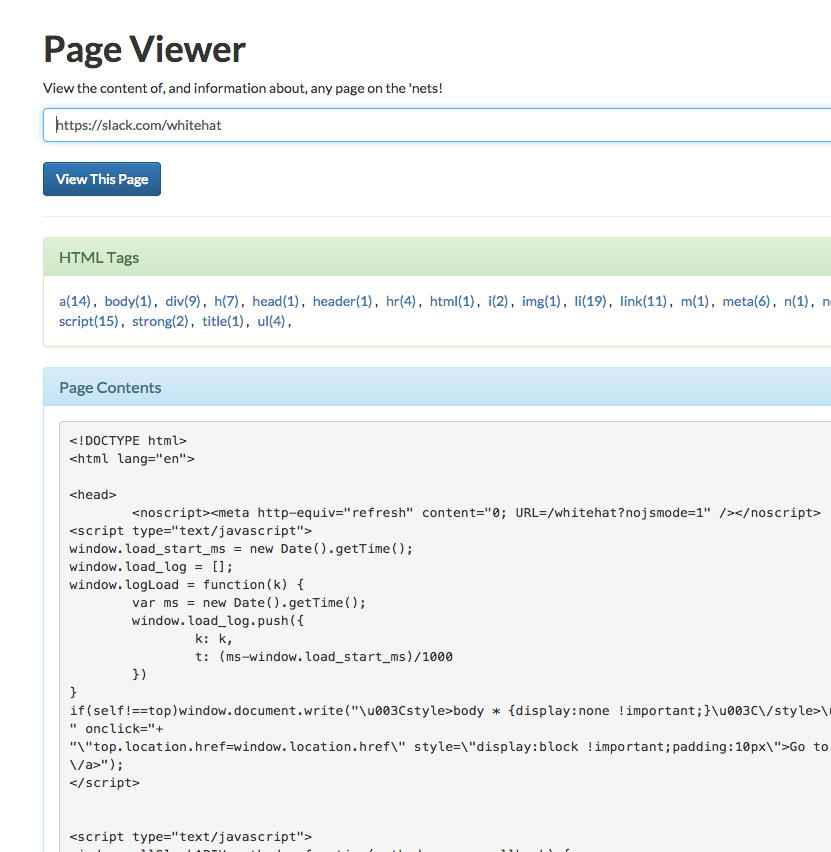

HTML Tag Analyzer
==================

A web application that analyzes a web page. Takes the url of a web page, retrieves it, prints out the source and displays a report of its html tags. The html tags are displayed with their usage count in the page's source. 

Click on one of the tags to highlight it in the source block below.

Written in PHP and Javascript.

## Requirements

Tested on PHP 5.6.

